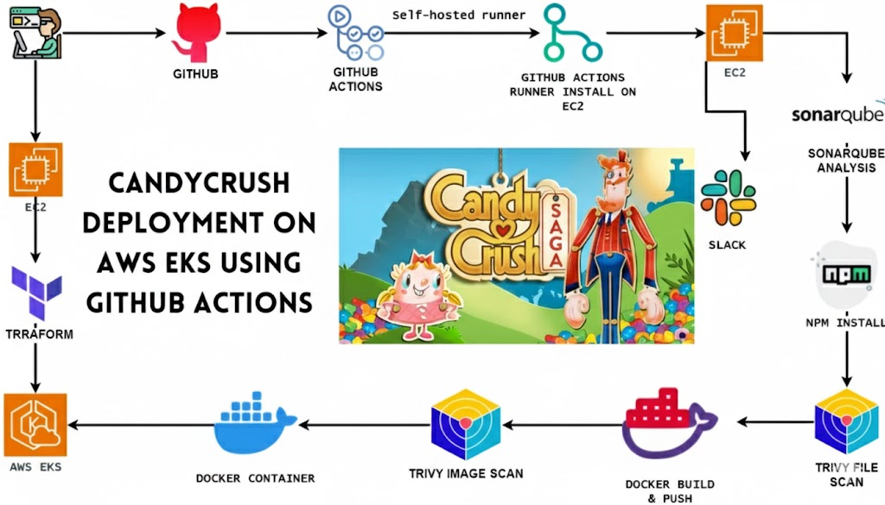

# 🍬 Candy Crush Game - React Application



## 🛠️ DevOps Tools & Technologies


## 📋 Project Overview

A fully functional Candy Crush game built with React, featuring a complete DevOps CI/CD pipeline with automated deployment to AWS EKS (Elastic Kubernetes Service). This project demonstrates modern cloud-native application development with security scanning, containerization, and Kubernetes orchestration.

## 🎮 Game Features

- Interactive Candy Crush gameplay built with React
- Responsive design for various screen sizes
- Modern UI with smooth animations
- Real-time score tracking

## 🛠️ Technologies & Tools Used

### Frontend Development
- **React** (v17.0.2) - UI framework
- **React DOM** (v17.0.2) - DOM rendering
- **React Scripts** (v4.0.3) - Build tooling
- **JavaScript (ES6+)** - Programming language
- **CSS3** - Styling

### DevOps & CI/CD
- **GitHub Actions** - CI/CD automation
- **Self-hosted Runner** - Custom build environment
- **Docker** - Containerization
- **Docker Hub** - Container registry

### Cloud Infrastructure
- **AWS EKS** - Kubernetes cluster management
- **Terraform** - Infrastructure as Code (IaC)
- **AWS S3** - Terraform state backend
- **AWS IAM** - Access management
- **Kubernetes** - Container orchestration
- **kubectl** - Kubernetes CLI

### Security & Code Quality
- **SonarQube** - Code quality analysis
- **Trivy** - Vulnerability scanning (filesystem & container images)

### Monitoring & Notifications
- **Slack Integration** - Build notifications

### Development Tools
- **Node.js** (v16) - Runtime environment
- **npm** - Package manager
- **AWS CLI** - AWS command-line interface

## 📁 Project Structure

```
Candycrush/
├── .github/
│   └── workflows/
│       └── deploy.yml          # GitHub Actions CI/CD pipeline
├── Eks-terraform/
│   ├── backend.tf              # S3 backend configuration
│   ├── main.tf                 # EKS cluster & node group setup
│   └── provider.tf             # AWS provider configuration
├── public/                     # Static assets
├── src/
│   ├── components/             # React components
│   ├── images/                 # Game images
│   ├── App.js                  # Main application component
│   ├── index.js                # Application entry point
│   └── index.css               # Global styles
├── Dockerfile                  # Container image definition
├── deployment-service.yml      # Kubernetes deployment & service
├── package.json                # Node.js dependencies
├── script.sh                   # Environment setup script
├── sonar-project.properties    # SonarQube configuration
└── candy-crush-game.jpg        # Project screenshot
```

## 🚀 Getting Started

### Prerequisites

- Node.js (v16 or higher)
- npm or yarn
- Docker (for containerization)
- AWS CLI (for cloud deployment)
- kubectl (for Kubernetes management)
- Terraform (for infrastructure provisioning)

### Local Development

1. **Clone the repository**
   ```bash
   git clone <repository-url>
   cd Candycrush
   ```

2. **Install dependencies**
   ```bash
   npm install
   ```

3. **Start development server**
   ```bash
   npm start
   ```
   
   The application will open at [http://localhost:3000](http://localhost:3000)

4. **Build for production**
   ```bash
   npm run build
   ```

5. **Run tests**
   ```bash
   npm test
   ```

## 🐳 Docker Deployment

### Build Docker Image
```bash
docker build -t candycrush .
```

### Run Container Locally
```bash
docker run -d -p 3000:3000 candycrush
```

### Push to Docker Hub
```bash
docker tag candycrush <your-dockerhub-username>/candycrush:latest
docker push <your-dockerhub-username>/candycrush:latest
```

## ☁️ AWS EKS Deployment

### Infrastructure Setup with Terraform

1. **Navigate to Terraform directory**
   ```bash
   cd Eks-terraform
   ```

2. **Initialize Terraform**
   ```bash
   terraform init
   ```

3. **Plan infrastructure changes**
   ```bash
   terraform plan
   ```

4. **Apply infrastructure**
   ```bash
   terraform apply
   ```

   This will create:
   - EKS Cluster (himanshu-candy)
   - Node Group with t2.medium instances
   - IAM roles and policies
   - VPC and subnet configurations

### Kubernetes Deployment

1. **Update kubeconfig**
   ```bash
   aws eks --region ap-south-1 update-kubeconfig --name himanshu-candy
   ```

2. **Deploy application**
   ```bash
   kubectl apply -f deployment-service.yml
   ```

3. **Check deployment status**
   ```bash
   kubectl get deployments
   kubectl get pods
   kubectl get services
   ```

4. **Access the application**
   ```bash
   kubectl get service candycrush-service
   ```
   Use the LoadBalancer external IP to access the game

## 🔄 CI/CD Pipeline

The project uses GitHub Actions for automated CI/CD with the following stages:

### Build, Analyze & Scan Job
1. **Code Checkout** - Fetch latest code
2. **SonarQube Analysis** - Code quality & security analysis
3. **Dependency Installation** - Install npm packages
4. **Trivy Filesystem Scan** - Scan source code for vulnerabilities
5. **Docker Build & Push** - Build and push image to Docker Hub
6. **Trivy Image Scan** - Scan Docker image for vulnerabilities

### Deploy Job
1. **Pull Docker Image** - Download latest image
2. **Image Security Scan** - Final vulnerability check
3. **Container Deployment** - Run Docker container
4. **Kubernetes Deployment** - Deploy to EKS cluster
5. **Slack Notification** - Send build status notification

## 🔐 Security Features

- **Trivy Scanning** - Automated vulnerability detection
- **SonarQube Analysis** - Code quality and security issues
- **Container Security** - Multi-stage scanning
- **IAM Roles** - Least privilege access
- **Private Subnets** - Network isolation

## 📊 Monitoring & Notifications

- Real-time Slack notifications for build status
- Kubernetes health checks
- Container logs via kubectl
- AWS CloudWatch integration

## 🔧 Configuration

### Required GitHub Secrets
- `SONAR_TOKEN` - SonarQube authentication token
- `SONAR_HOST_URL` - SonarQube server URL
- `DOCKERHUB_USERNAME` - Docker Hub username
- `DOCKERHUB_TOKEN` - Docker Hub access token
- `SLACK_WEBHOOK_URL` - Slack webhook for notifications
- AWS credentials (configured on self-hosted runner)

### Environment Variables
- AWS Region: `ap-south-1`
- EKS Cluster Name: `himanshu-candy`
- Container Port: `3000`
- Service Port: `80`

## 📦 Dependencies

### Production Dependencies
- @testing-library/jest-dom: ^5.11.4
- @testing-library/react: ^11.1.0
- @testing-library/user-event: ^12.1.10
- react: ^17.0.2
- react-dom: ^17.0.2
- react-scripts: 4.0.3
- web-vitals: ^1.0.1

## 🎯 Key Features

✅ Automated CI/CD pipeline with GitHub Actions  
✅ Container security scanning with Trivy  
✅ Code quality analysis with SonarQube  
✅ Infrastructure as Code with Terraform  
✅ Kubernetes orchestration on AWS EKS  
✅ Docker containerization  
✅ Slack integration for notifications  
✅ Self-hosted runner for custom build environment  
✅ LoadBalancer service for external access  

## 📝 Setup Script

The `script.sh` file automates the installation of all required tools:
- Java 17 (Temurin)
- Trivy security scanner
- Terraform
- kubectl
- AWS CLI
- Node.js 16 & npm

Run the script on your self-hosted runner:
```bash
chmod +x script.sh
./script.sh
```

## 🤝 Contributing

1. Fork the repository
2. Create a feature branch
3. Commit your changes
4. Push to the branch
5. Open a Pull Request


## 🔗 Related Resources

- [React Documentation](https://reactjs.org/)
- [AWS EKS Documentation](https://docs.aws.amazon.com/eks/)
- [Terraform AWS Provider](https://registry.terraform.io/providers/hashicorp/aws/latest/docs)
- [Kubernetes Documentation](https://kubernetes.io/docs/)
- [Docker Documentation](https://docs.docker.com/)
- [Trivy Documentation](https://aquasecurity.github.io/trivy/)

---

**Note**: Make sure to update the Docker Hub username and AWS configurations according to your setup before deploying.
